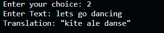

# TranslatorTwoThousand
Language translator from English

# Language select:

# I tested using these inputs:
# text input mode: lets go dancing

# url mode: https://pastebin.com/raw/xc498KV7

# text file input: file.txt
